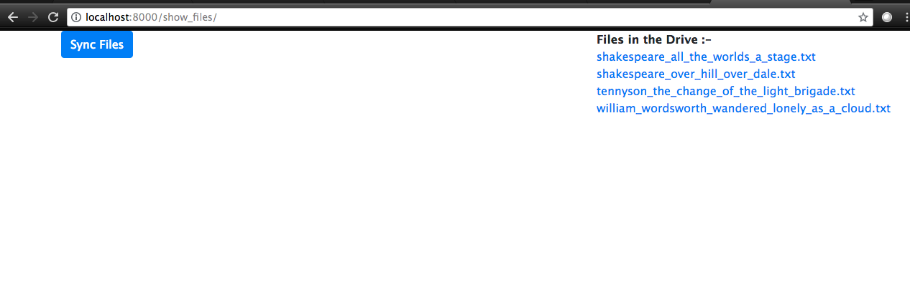
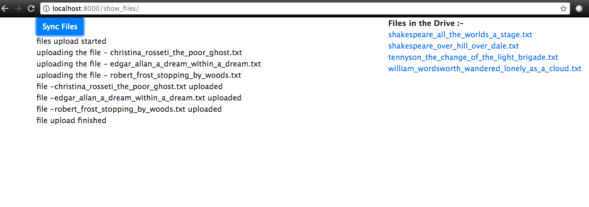

# file_manager_repo
This app is a basic Django app to upload files from users local computer to the remote server.
I have used Django Channels, to do the file upload in the an asynchronous manner.
I have taken a few screen shots to explain the steps.

Step 1: On the landing page of the application all the already uploaded files in the remote drive is shown.

Step 2: On click on the Sync-Files button , new files in the users local directory will get start to upload.
Channels will notify the user when the file upload is done.

Step 3: After the upload newly uploaded will also appear in the files-in-the-drive list.

Step 4: If the user clicks on the name of any file , the content of the file will appear in the browser.

